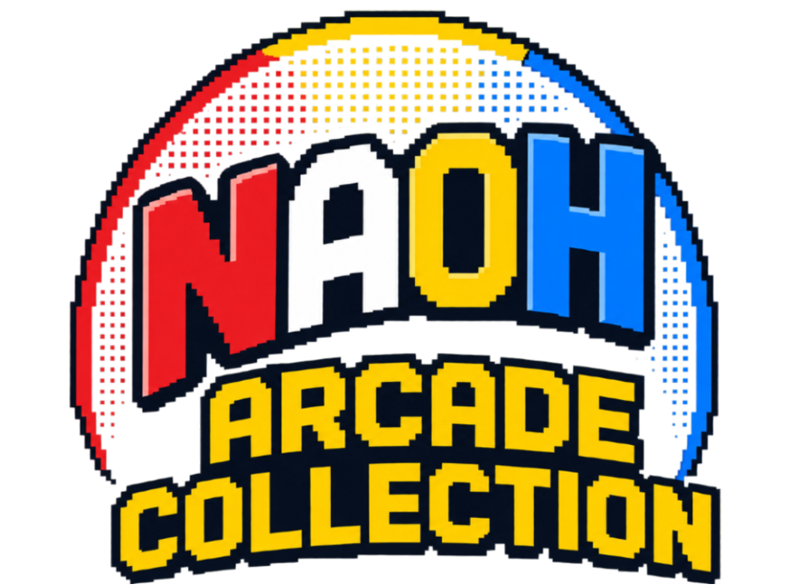
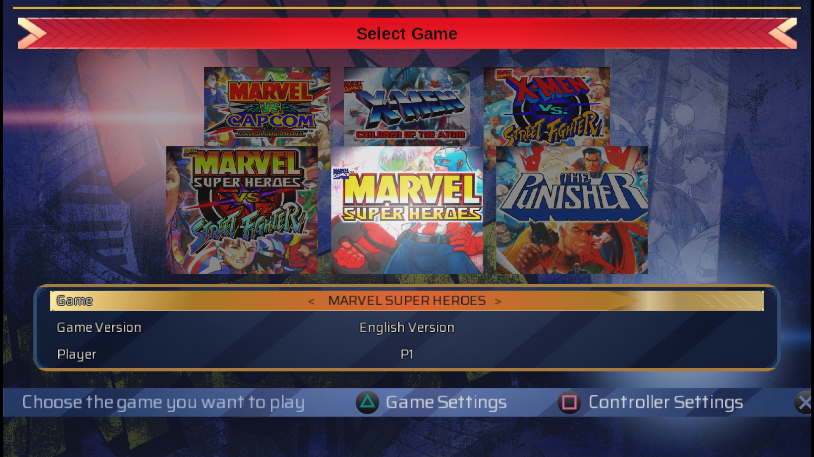
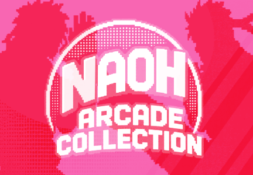
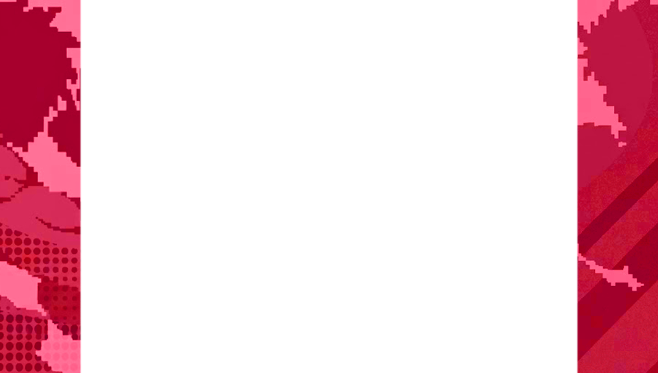
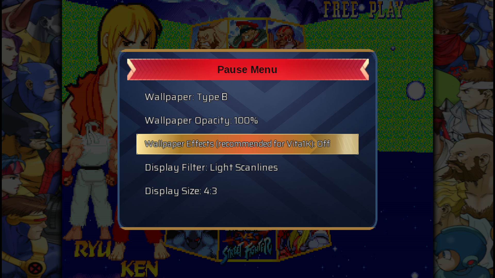

<p align="center">
  
</p>

---

**NAOH: Arcade Collection** is a native PlayStation Vita arcade launcher written in C. It statically links the FB Alpha 2012 (CPS2) and MAME 2000 libretro cores behind a custom `vita2d`-rendered front end, so a set of classic Marvel vs Capcom arcade games can be launched and played.

> [!WARNING]
> If you own a PS Vita 1000, it is not recommended to use overlays for extended periods, as static images may cause image retention or burn-in on its OLED display. Additionally, use caution with the new wallpaper effects on Vita 1K models, as they can have a greater performance impact.

## Download & Install

You can download the latest `.vpk` from the [Releases](../../releases) page and install it with VitaShell, same as any other homebrew.

**This project does not include any ROMs**. On first launch it creates `ux0:data/NaohAC/` with `roms`, `covers`, `overlays`, `saves`, and `system` subfolders. See [ROM & Asset Setup](#rom--asset-setup) below before launching.

## Supported Games

NAOH 2.0 now supports selecting the ROM region (European, USA, or Japanese) and game version directly from the main menu. The bundled cores are matched against specific romsets under exact filenames. 

<p align="center">
  
</p>

| ZIP Filename    | Game                                     | Region | Reference Version |
| --------------- | ---------------------------------------- | ------ | ----------------- |
| `msh.zip`       | Marvel Super Heroes                      | Europe | 951024            |
| `mshj.zip`      | Marvel Super Heroes                      | Japan  | 951117            |
| `mshh.zip`      | Marvel Super Heroes                      | USA    | 951117            |
| `mshvsf.zip`    | Marvel Super Heroes vs. Street Fighter   | Europe | 970625            |
| `mshvsfj.zip`   | Marvel Super Heroes vs. Street Fighter   | Japan  | 970707            |
| `mshvsfu.zip`   | Marvel Super Heroes vs. Street Fighter   | USA    | 970707            |
| `mvsc.zip`      | Marvel vs. Capcom: Clash of Super Heroes | Europe | 980123            |
| `mvscj.zip`     | Marvel vs. Capcom: Clash of Super Heroes | Japan  | 980123            |
| `mvscu.zip`     | Marvel vs. Capcom: Clash of Super Heroes | USA    | 980123            |
| `punisher.zip`  | The Punisher                             | Europe | Any revision      |
| `punisherj.zip` | The Punisher                             | Japan  | Any revision      |
| `punisheru.zip` | The Punisher                             | USA    | Any revision      |
| `xmcota.zip`    | X-Men: Children of the Atom              | Europe | 950331            |
| `xmcotaj.zip`   | X-Men: Children of the Atom              | Japan  | 950105            |
| `xmcotau.zip`   | X-Men: Children of the Atom              | USA    | 950105            |
| `xmvsf.zip`     | X-Men vs. Street Fighter                 | Europe | 961004            |
| `xmvsfj.zip`    | X-Men vs. Street Fighter                 | Japan  | 961023            |
| `xmvsfu.zip`    | X-Men vs. Street Fighter                 | USA    | 961023            |

### ROM Notes & Extraction
* **Marvel vs. Capcom Fighting Collection Arcade Classics (PC):** The launcher is fully compatible with all ROMs extracted from the official PC version of *Marvel vs. Capcom Fighting Collection Arcade Classics*. This is the expected and recommended way to obtain the ROMs.
* **The Punisher:** This ROM cannot be extracted from the PC collection. Users must obtain their own backup, regardless of region. Any revision works as long as it matches the required filenames, as MAME does not support Free Play for it.
* **Extraction Tool:** It is recommended to use the [mvscc-romforge](https://github.com/KiddRwxSsj/mvscc-romforge) tool to extract the USA ROMs from your legally owned PC copy.
* **USA ROMs Note:** `mshh.zip` does not feature a Free Play mode.
* **Free Play & Difficulty:** All supported ROMs (except The Punisher and `mshh.zip`) have their `.nv` files configured to load with Free Play enabled and normal difficulty by default.

## ROM & Asset Setup

All paths are on `ux0:` and are created automatically the first time you run the app, so you can also just copy files in and they'll be picked up.

* **ROMs** — `ux0:data/NaohAC/roms/`
Copy in only the filenames from the table above, exactly as written (lowercase, matching extension). 
* **Covers** — `ux0:data/NaohAC/covers/`
Optional. Name each file after its ROM filename with the `.zip` replaced by `.png` (e.g. `msh.zip` → `msh.png`, `mshvsf.zip` → `mshvsf.png`). Resolution must be **432×300**.
* **Overlays** — `ux0:data/NaohAC/overlays/`
Optional. Ten slots, named `1.png` through `10.png`. Resolution must be **960×544** (full screen). Cycle through them in the pause menu; overlays only render in 4:3 or 5:4 aspect mode, where they fill the borders left by the game's native resolution.

**Asset Templates:**
Use the images in the `templates/` folder of this repository as sizing guides.

| Cover Art (432×300) | Overlay (960×544) |
| :---: | :---: |
|  |  |

## Features & UI (New in v2.0)
* **Authentic Interface:** The UI, pause menu, terminology, and overall layout have been heavily reworked to be as similar as possible to MVCC.
* **Custom Controls:** Configure controls individually for each game directly from the menu. All buttons can be customized.
* **Per-Game Settings:** Display filters (Scanlines, Grid, RGB Mask, Interlace, etc.) and overlay configurations are now persistent on a per-game basis.
* **Visuals:** Added wallpaper opacity settings and different wallpaper effects.
* **Player Side Selection:** Choose whether you want to play from the Player 1 side or the Player 2 side (Note: this is not multiplayer support, just a side preference).
* **Error Handling:** Added an error screen to provide context instead of silent crashes.

<p align="center">
  
</p>

## Controls & In-Game Menus
 
* **Pause Menu:** Press **SELECT**, at any time during gameplay, to pause. From the pause menu you can:
    * **Resume** — close the menu and return to the game.
    * **Quick Save / Quick Load** — instantly save or load your current state.
    * **Restart Game** — quickly reboot the current ROM.
    * **Options** — switch between **Aspect Ratio** (Fullscreen / 4:3 / 5:4) and cycle through **Overlay** slots or **Display Filters**. Press ✕ to change the highlighted value, ○ to go back to the main pause screen.
    * **Exit** — close the running game and return to the launcher grid.
* **Insert Coin:** You can use **Touch input** on the screen to insert a coin. This is particularly useful for *The Punisher*, which lacks a Free Play mode.
* **Dip Switches:** Hold **START** to open the dip switches menu. This allows you to change game difficulty and other internal arcade settings, and these changes will be saved.

## Credits

This project builds on the work of several open-source and freely licensed projects:

* **FB Alpha 2012 (CPS2 core):** [libretro/fbalpha2012_cps2](https://github.com/libretro/fbalpha2012_cps2) — originally by Dave (finalburn.com) and the FB Alpha team.
* **MAME 2000 core:** [libretro/mame2000-libretro](https://github.com/libretro/mame2000-libretro) — based on MAME 0.37b5.
* **Font:** [Saira](https://fonts.google.com/specimen/Saira) by Omnibus-Type.
* **Sound effects:** [Arcade Sound Effects Pack](https://ci.itch.io/arcade-sound-effects-pack) by Chequered Ink.
* **Ogg decoding:** [stb_vorbis](https://github.com/nothings/stb) by Sean Barrett.

Arcade titles listed above remain the property of their respective copyright holders and are not distributed with this project.

## License

The original code in this repository (`main.c`, `Makefile`) is released under the **zlib license** — see [LICENSE](LICENSE).

The compiled `.vpk` statically links the FB Alpha 2012 CPS2 and MAME 2000 cores, both of which are **non-commercial only**. That restriction applies to any build or release of this project regardless of the license on the original code. Font and sound assets carry their own licenses (SIL OFL 1.1 and a free-for-any-use asset license, respectively). Full details, exact license text, and compliance notes for every third-party component are in [NOTICE.md](NOTICE.md) — read it before publishing a release.

## AI Assistance

Parts of the code were written or improved with the assistance of AI. All AI-assisted code was thoroughly reviewed, tested, and validated manually, with the overall implementation and debugging process remaining under human supervision.

## Building from source (PS Vita)

You'll need [VitaSDK](https://vitasdk.org/) installed and `VITASDK` exported, plus the two core repos checked out under `cores/`:

```bash
mkdir -p cores
git clone [https://github.com/libretro/fbalpha2012_cps2](https://github.com/libretro/fbalpha2012_cps2) cores/fbalpha2012_cps2
git clone [https://github.com/libretro/mame2000-libretro](https://github.com/libretro/mame2000-libretro) cores/mame2000
make -j$(nproc)
