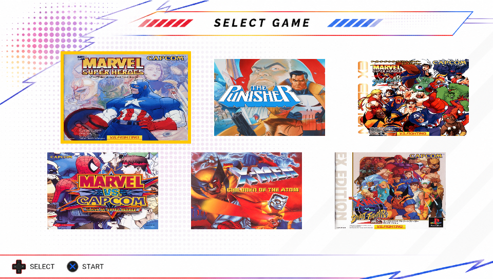

<p align="center">
  
</p>

---

**NAOH: Arcade Collection** is a native PlayStation Vita arcade launcher written in C. It statically links the FB Alpha 2012 (CPS2) and MAME 2000 libretro cores behind a custom `vita2d`-rendered front end, so a set of classic Marvel vs Capcom arcade games can be launched and played.

> [!WARNING]
> If you own a PS Vita 1000, it is not recommended to use overlays for extended periods,
> as static images may cause image retention or burn-in on its OLED display.


## Download & Install

You can download the latest `.vpk` from the [Releases](../../releases) page and install it with VitaShell, same as any other homebrew.

**This project does not include any ROMs.** On first launch it creates `ux0:data/NaohAC/` with `roms`, `covers`, `overlays`, `saves`, and `system` subfolders. See [ROM & Asset Setup](#rom--asset-setup) below before launching.

## Supported Games

> **English/US versions only.** The bundled cores are matched against specific romsets. Japanese, Asia, or other regional dumps **will not work** — renaming a wrong-region ROM to the filename below does not make it compatible and will cause the game to fail to load or crash the app. Each ROM must be the exact US-region set below, under its exact filename.

| Game                                    | Core               | Required filename   |
|------------------------------------------|--------------------|----------------------|
| Marvel Super Heroes (US)                  | FB Alpha 2012 CPS2 | `msh.zip`            |
| Marvel Super Heroes vs. Street Fighter (US)| FB Alpha 2012 CPS2 | `mshvsf.zip`          |
| Marvel vs. Capcom (US)                    | FB Alpha 2012 CPS2 | `mvsc.zip`            |
| X-Men: Children of the Atom (US)          | FB Alpha 2012 CPS2 | `xmcota.zip`          |
| X-Men vs. Street Fighter (US)             | FB Alpha 2012 CPS2 | `xmvsf.zip`           |
| The Punisher (US)                         | MAME 2000          | `punisher.zip`        |

## ROM & Asset Setup

All paths are on `ux0:` and are created automatically the first time you run the app, so you can also just copy files in and they'll be picked up.

**ROMs** — `ux0:data/NaohAC/roms/`
Copy in only the filenames from the table above, exactly as written (lowercase, matching extension). The scanner matches on filename only — it does not verify region — so a `msh.zip` that is secretly a Japanese or Asia dump will still show up in the menu but will fail to run correctly. Only the US-region set for each game is supported.

**Covers** — `ux0:data/NaohAC/covers/`
Optional. Name each file after its ROM filename with the `.zip` replaced by `.png` (e.g. `msh.zip` → `msh.png`, `mshvsf.zip` → `mshvsf.png`). Resolution: **432×300**.

**Overlays** — `ux0:data/NaohAC/overlays/`
Optional. Ten slots, named `1.png` through `10.png`. Resolution: **960×544** (full screen). Cycle through them in the pause menu; overlays only render in 4:3 or 5:4 aspect mode, where they fill the borders left by the game's native resolution.

<p align="center">
  
</p>

## Controls — Pause Menu
 
Press **SELECT + START** together, at any time during gameplay, to pause. From the pause menu you can:
 
* **Resume** — close the menu and return to the game.
* **Options** — switch between **Aspect Ratio** (Fullscreen / 4:3 / 5:4) and cycle through the ten **Overlay** slots (or off). Press ✕ to change the highlighted value, ○ to go back to the main pause screen.
* **Exit** — close the running game and return to the launcher grid.

## Credits

This project builds on the work of several open-source and freely licensed projects:

* **FB Alpha 2012 (CPS2 core):** [libretro/fbalpha2012_cps2](https://github.com/libretro/fbalpha2012_cps2) — originally by Dave (finalburn.com) and the FB Alpha team.
* **MAME 2000 core:** [libretro/mame2000-libretro](https://github.com/libretro/mame2000-libretro) — based on MAME 0.37b5.
* **Font:** [Press Start 2P](https://fonts.google.com/specimen/Press+Start+2P) by Cody "CodeMan38" Boisclair.
* **Sound effects:** [Arcade Sound Effects Pack](https://ci.itch.io/arcade-sound-effects-pack) by Chequered Ink.
* **Ogg decoding:** [stb_vorbis](https://github.com/nothings/stb) by Sean Barrett.

Arcade titles listed above remain the property of their respective copyright holders and are not distributed with this project.

## License

The original code in this repository (`main.c`, `Makefile`) is released under the **zlib license** — see [LICENSE](LICENSE).

The compiled `.vpk` statically links the FB Alpha 2012 CPS2 and MAME 2000 cores, both of which are **non-commercial only**. That restriction applies to any build or release of this project regardless of the license on the original code. Font and sound assets carry their own licenses (SIL OFL 1.1 and a free-for-any-use asset license, respectively). Full details, exact license text, and compliance notes for every third-party component are in [NOTICE.md](NOTICE.md) — read it before publishing a release.

## AI Assistance

Parts of the code were written or improved with the assistance of AI. All AI-assisted code was thoroughly reviewed, tested, and validated manually, with the overall implementation and debugging process remaining under human supervision.

## Building from source (PS Vita)

You'll need [VitaSDK](https://vitasdk.org/) installed and `VITASDK` exported, plus the two core repos checked out under `cores/`:

```bash
mkdir -p cores
git clone https://github.com/libretro/fbalpha2012_cps2 cores/fbalpha2012_cps2
git clone https://github.com/libretro/mame2000-libretro cores/mame2000
make -j$(nproc)
```

The `Makefile` builds both cores via their own `makefile.libretro`, resolves duplicate symbols between them, links everything into a single ELF, and packs the result into `naoh_arcade_collection.vpk` alongside the assets in `assets/` and `sce_sys/`.
